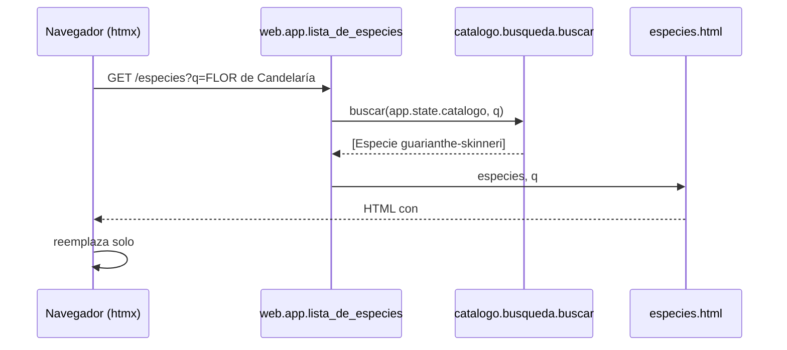
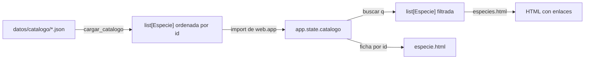

# Epic e1: Species catalog — Docs

> Provisional — revise once a real run under this skill shows what the
> shape should actually be; do not treat this as a settled contract.

## Worked example

Una persona escribe "FLOR de Candelaría" en el buscador de `/especies`.

1. **Navegador → aplicación.** htmx (`hx-get="/especies"`, disparo `input changed delay:300ms`) pide `GET /especies?q=FLOR%20de%20Candelar%C3%ADa`. Sin JavaScript, el mismo campo viaja como un formulario `GET`.
2. **Ruta.** `lista_de_especies` (`src/orquidea/web/app.py`) recibe `q="FLOR de Candelaría"` y llama `buscar(request.app.state.catalogo, q)`.
3. **Normalización.** `_normalizar` (`src/orquidea/catalogo/busqueda.py`) pasa la consulta a minúsculas y descompone (NFKD) quitando las marcas: `"flor de candelaria"`.
4. **Coincidencia.** Se busca la subcadena en el nombre científico y en cada nombre común, también normalizados; coincide con `"Flor de Candelaria"` de `guarianthe-skinneri` (dato de `src/orquidea/datos/catalogo/guarianthe-skinneri.json`).
5. **Plantilla.** `especies.html` recibe `especies=[Guarianthe skinneri]` y `q`, y pinta un `<li><a href="/especies/guarianthe-skinneri">Guarianthe skinneri</a></li>` dentro de `#resultados`; htmx reemplaza solo ese bloque (`hx-select="#resultados"`).
6. **Ficha.** Al abrir el enlace, `ficha_de_especie` busca la `Especie` por `id` y `especie.html` muestra descripción, los cuatro cuidados (por ejemplo, temperatura: "Noches de 12.7 a 22.2 °C y días de 21.1 a 29.4 °C...") y, junto a cada uno, su fuente (la hoja de cultivo de Cattleya de la AOS, con la aclaración de que es del género).

Entrada parecida: `q=RADICÁNS` devuelve `epidendrum-radicans`; `q=orquidea` devuelve 16 especies; `q=zzz` devuelve 200 con "No hay especies que coincidan con la búsqueda."

## Extension guide

**Añadir una especie al catálogo** (el punto de extensión principal; el catálogo lo mantiene el equipo desde código, RF-01):

1. Crear `src/orquidea/datos/catalogo/{id}.json`, con `id` en minúsculas y guiones (`epidendrum-radicans`), y los campos de `Especie` (`src/orquidea/catalogo/modelo.py`): `nombre_cientifico`, `nombres_comunes` (lista, puede ir vacía), `descripcion`, `cuidados` (`luz`, `riego`, `temperatura`, `sustrato`, cada uno con `texto` y `fuente`) y `fuentes` (al menos una).
2. Cada `fuente` cita una fuente realmente consultada, con URL y fecha ("consultada el AAAA-MM-DD"); si el cuidado es de un género y no de la especie, dilo en la fuente.
3. Correr `uv run pytest tests/test_catalogo_real.py` y `./scripts/check`. El cargador rechaza todo el catálogo si un archivo falla y dice `archivo: campo: motivo`.

**Errores comunes:** un campo mal escrito (el modelo usa `extra="forbid"`, así que se rechaza), una `id` repetida en dos archivos, una cadena vacía en `nombres_comunes`, o una fuente sin URL (la prueba `test_toda_fuente_del_catalogo_real_trae_url_y_fecha_de_consulta` la detecta).

**Añadir un campo a la especie:** cambiarlo en `Especie`/`Cuidados`, actualizar los JSON, la plantilla `especie.html` y las fixtures de `tests/test_catalogo_modelo.py`, `tests/test_catalogo_carga.py` y `tests/test_web_especies.py`; ejecutar `./scripts/check`. Si el campo es obligatorio, los 100 JSON deben actualizarse en el mismo cambio.

**Añadir una ruta:** en `src/orquidea/web/app.py`, con su plantilla que extienda `base.html`. Cuando llegue la sesión (e2), `/salud` debe quedar fuera de la protección.

## Data flow

| Paso | Módulo | Tipo en la frontera |
|------|--------|---------------------|
| Leer y validar los JSON | `orquidea.datos.catalogo.cargar_catalogo` | `Path` → `list[Especie]` o `CatalogoInvalido` |
| Modelo de la especie | `orquidea.catalogo.modelo` (`Especie`, `Cuidados`, `Cuidado`) | JSON → objetos pydantic estrictos |
| Estado de la aplicación | `orquidea.web.app` (`app.state.catalogo`) | `list[Especie]`, cargada una vez al importar |
| Búsqueda | `orquidea.catalogo.busqueda.buscar` | `(list[Especie], str)` → `list[Especie]` |
| Presentación | `orquidea.web.app` y `web/templates/*.html` | `Especie` → HTML escapado |

Las dependencias van solo hacia adentro: `web` → `catalogo` y `datos`; `datos` → `catalogo`; `catalogo` no importa a nadie del proyecto.

## Invariants & contracts

| Invariante | Síntoma si se rompe | Cómo comprobarlo |
|------------|--------------------|------------------|
| El catálogo se carga completo o no se carga (RF-01) | La aplicación arranca con menos especies de las esperadas, o falla a medias | `tests/test_catalogo_carga.py::test_todo_o_nada_con_un_archivo_invalido`; arrancar la app con un JSON roto debe fallar con `CatalogoInvalido` |
| Toda especie y todo cuidado cita una fuente con URL y fecha (`must-data-001`) | Una ficha muestra un dato sin origen | `tests/test_catalogo_real.py` |
| Los cuidados de género se declaran como tales | Una ficha presenta un dato genérico como si fuera medido para la especie | `test_los_cuidados_de_genero_lo_dicen` |
| `id` única y en formato slug | Dos fichas comparten URL, o una URL no resuelve | `test_ids_duplicadas_nombran_ambos_archivos`, `test_id_debe_ser_slug` |
| La búsqueda ignora mayúsculas y acentos (RF-02) | "ORQUIDEA" no encuentra "orquídea" | `tests/test_catalogo_busqueda.py` |
| Los datos del catálogo se escapan al pintar la página | Una etiqueta HTML en un nombre se ejecuta | `test_lista_escapa_el_html_de_los_datos` |
| `orquidea.catalogo` no importa `orquidea.web` (system-design) | Un ciclo de importación o el dominio atado a HTTP | `grep -rn "orquidea.web" src/orquidea/catalogo src/orquidea/datos` no devuelve nada |
| `/salud` responde 200 sin sesión ni catálogo | Dokploy marca la aplicación como caída | `tests/test_web_inicio.py::test_salud_responde_ok_sin_depender_del_catalogo` |
| La primera carga ≤ 5 s con "Slow 3G" y ≤ 200 KB (`must-perf-001`) | Página lenta en redes de baja calidad | Medición manual con las herramientas del navegador (pendiente de verificar en el VPS); peso medido: lista 1,884 B, ficha 1,035 B, htmx 16,356 B con gzip |

## Failure-mode catalog

| Síntoma | Causa raíz | Diagnóstico | Arreglo |
|---------|-----------|-------------|---------|
| La aplicación no arranca: `CatalogoInvalido: x.json: fuentes: Field required` | Un JSON del catálogo no cumple el esquema (el catálogo se carga al importar `orquidea.web.app`) | Leer el mensaje: dice archivo y campo; `uv run python -c "from orquidea.datos.catalogo import *; cargar_catalogo(DIRECTORIO_CATALOGO)"` reúne todos los errores | Corregir el JSON señalado |
| Una mutación de prueba "sobrevive" aunque el código cambió | Bytecode obsoleto (mismo tamaño y mismo segundo de mtime) | Repetir con `PYTHONDONTWRITEBYTECODE=1` y sin `__pycache__` (retrospectiva de s1.2) | Correr las mutaciones sin caché |
| `./scripts/check` falla en `ruff format` por un archivo `.md` | `ruff format` formatea también los bloques de código de los Markdown (retrospectiva de s1.2) | El gate señala el `.md` | `uv run ruff format` completo antes del gate |
| `TestClient` avisa que `httpx` está obsoleto | Starlette 1.6 usa `httpx2` | El aviso lo dice | Dependencia de desarrollo `httpx2` |
| Una prueba de la lista o la ficha ve el catálogo de otra | `app.state.catalogo` es un estado global compartido | Ver si la prueba usa la fixture `client`, que lo restaura | Usar la fixture; recomendado unificarla en un `conftest.py` (parking lot) |
| `/especies` responde 200 con "Aún no hay especies" en el VPS | El catálogo no viajó en la imagen o el wheel no incluyó los JSON | `uv build` y listar el wheel (100 `.json` bajo `orquidea/datos/catalogo/`); en el contenedor, `ls` de ese directorio | Revisar `.dockerignore` y que `src` se copie entero |
| El primer `docker build` falla en `pip install uv==0.12.7` | La versión fijada no existe en el índice (no se pudo construir la imagen en desarrollo) | Leer el error del build en Dokploy | Ajustar la versión de `uv` en el `Dockerfile` |
| Una ficha muestra un cuidado que no corresponde a la especie | Los cuidados son de género y hay especies del género con requisitos distintos | Comparar con la tarjeta del género en la AOS (URL en la fuente del dato) | Sustituir por una fuente de la especie y quitar la aclaración de género |
| La búsqueda no encuentra un nombre con "ñ" escrito con "n" | No pasa: la "ñ" se normaliza como "n" (RF-02, "ignorar acentos") | `buscar(catalogo, "nino")` | — (es el comportamiento pedido) |
