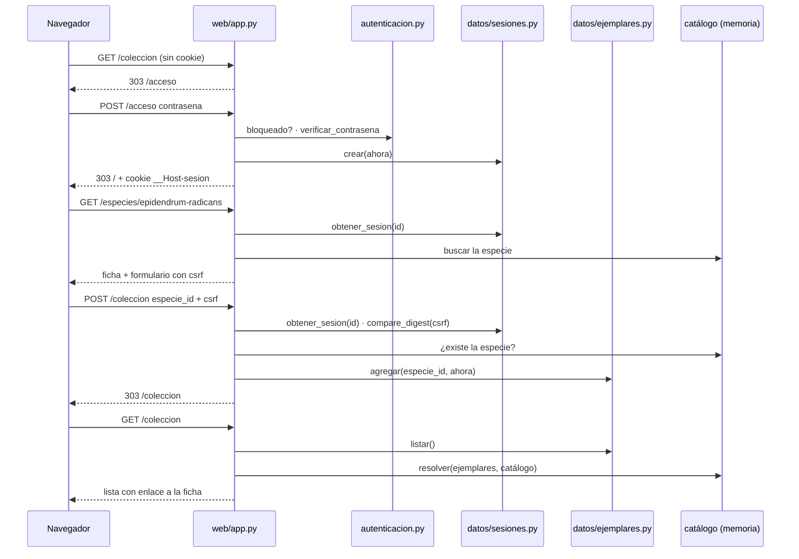
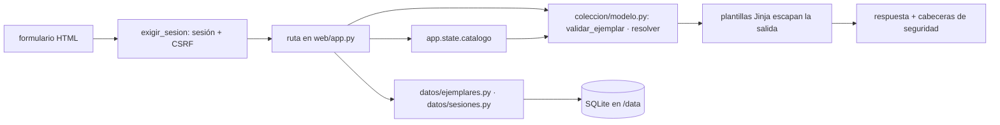

# Epic e2: Personal collection with login — Docs

> Provisional — revise once a real run under this skill shows what the
> shape should actually be; do not treat this as a settled contract.

## Worked example

Operación más representativa: **el dueño inicia sesión, abre la ficha de *Epidendrum radicans*, la agrega a su colección y la ve en "Mi colección"** (es el recorrido que fija `tests/test_recorrido_coleccion.py`). Valores reales:

1. Configuración: `ORQUIDEA_PASSWORD_HASH=scrypt$65536$8$2$<sal>$<hash>` (generado con `uv run python -m orquidea.autenticacion` para la contraseña `orquidea-2026`) y `ORQUIDEA_DB=/data/orquidea.sqlite3`. Al arrancar, `ciclo_de_vida` (`src/orquidea/web/app.py`) configura el registro y llama `abrir_base`, que aplica `0001-sesiones.sql` y `0002-ejemplares.sql` (`PRAGMA user_version` = 2).
2. `GET /coleccion` sin cookie → `exigir_sesion` no halla sesión → `SesionRequerida` → **303** `Location: /acceso`.
3. `POST /acceso` con `contrasena=orquidea-2026`: `LimiteDeIntentos.bloqueado` = falso → `verificar_contrasena` deriva scrypt con los parámetros de la cadena y compara con `hmac.compare_digest` → `limite.acierto()` → `crear` guarda en `sesiones` la fila `(id_hash = sha256(id), csrf, creada, ultima_actividad)` y devuelve el identificador de 43 caracteres → **303** `Location: /` con `Set-Cookie: __Host-sesion=<id>; HttpOnly; Max-Age=43200; Path=/; SameSite=lax; Secure`. Se registra `INFO orquidea.acceso - acceso correcto`.
4. `GET /especies/epidendrum-radicans` con la cookie → `exigir_sesion` valida la sesión (renueva `ultima_actividad`) y deja `request.state.sesion`; la ficha trae el formulario `<form method="post" action="/coleccion">` con `csrf=<token de la sesión>` y `especie_id=epidendrum-radicans`.
5. `POST /coleccion` con `especie_id=epidendrum-radicans&csrf=<token>` → `exigir_sesion` compara el token con `compare_digest` → la ruta comprueba que la especie existe en `app.state.catalogo` → `agregar(conexion, "epidendrum-radicans", 1_780_000_000)` inserta `(id=1, especie_id, nombre='', notas='', creado=1780000000)` → **303** `Location: /coleccion`.
6. `GET /coleccion` → `listar` devuelve `[Ejemplar(id=1, …)]` → `resolver` lo empareja con la `Especie` del catálogo → la plantilla muestra `<a href="/especies/epidendrum-radicans"><i>Epidendrum radicans</i></a>`, "Agregado el 2026-05-28" (UTC) y los enlaces "Editar" y "Quitar".

## Extension guide

**Extensión principal: añadir una tabla, su repositorio y sus rutas** (por ejemplo los riegos de la versión 0.2). Toda ruta nueva nace protegida y con CSRF sin escribir código de seguridad.

1. **Migración:** crea `src/orquidea/datos/migraciones/0003-riegos.sql` (`CREATE TABLE riegos (id INTEGER PRIMARY KEY, ejemplar_id INTEGER NOT NULL REFERENCES ejemplares(id) ON DELETE CASCADE, fecha INTEGER NOT NULL);`). La numeración debe ser continua desde `0001`; nunca edites una migración ya aplicada, agrega otra. Las claves foráneas están activas (`PRAGMA foreign_keys = ON` en `conectar`).
2. **Dominio:** modelo pydantic y validación en `src/orquidea/coleccion/modelo.py` (o un módulo nuevo en `orquidea/coleccion/`); no importes `sqlite3` ni `orquidea.web` ahí.
3. **Repositorio:** `src/orquidea/datos/riegos.py`, con SQL **literal y parametrizado** (`?`), siguiendo `datos/ejemplares.py` (`ruff` S608 rechaza SQL armado con f-strings).
4. **Rutas:** en `src/orquidea/web/app.py`, con `conexion: Base` y, si escriben, `Annotated[str, Form()]`. El `POST` recibe el token CSRF si su formulario incluye ``. Patrón POST-redirección-GET (303) y `_ejemplar_o_404` para un identificador inexistente.
5. **Plantilla:** en `src/orquidea/web/templates/`; Jinja escapa la salida; **nunca** uses `|safe` con datos del usuario.
6. **Variables de entorno nuevas:** documéntalas en `README.md` (la prueba `tests/test_despliegue.py` falla si el código lee un `ORQUIDEA_*` que el README no menciona).
7. **Pruebas a correr después:** `./scripts/check` completo; `tests/test_web_proteccion.py` (enumera `app.routes`: si tu ruta quedó pública por error, falla); `tests/test_web_coleccion.py` como modelo de pruebas web con `client` (con sesión) y `anonimo` (sin ella).

**Hacer pública una ruta** (solo el acceso y `/salud` lo son): añadirla a `RUTAS_PUBLICAS` en `app.py` y a la prueba `test_las_rutas_publicas_son_solo_el_acceso_y_la_salud`; es una decisión de seguridad, no un atajo.

**Errores comunes:** olvidar `` en un formulario (403 al enviarlo); usar `check_same_thread` de otra forma (la conexión se abre por petición con `conectar`, sin compartirse); hacer un `GET` que cambie datos (los métodos seguros no piden token); escribir una prueba que comparta un valor con otro elemento de la página (aíslala con una regex sobre el `<form>`); cambiar la política de la cookie sin revisar el prefijo `__Host-` (exige `Secure`).

## Data flow

Pipelines implementados, con el módulo responsable de cada transformación y los tipos en cada frontera:

| Pipeline | Recorrido | Tipos en la frontera |
|----------|-----------|----------------------|
| Migraciones al arrancar | `ciclo_de_vida` → `datos.base.abrir_base(ruta) -> sqlite3.Connection` → `_pendientes` (valida `NNNN-*.sql` continuos) → `_aplicar` (una transacción por migración, `PRAGMA user_version`) | `Path` → `Connection`; error `MigracionFallida` |
| Acceso | formulario `contrasena: str` → `LimiteDeIntentos` (`autenticacion.py`) → `verificar_contrasena(str, str \| None) -> bool` → `datos.sesiones.crear(conexion, int) -> tuple[str, Sesion]` → cookie | `Sesion(csrf: str)` |
| Cada petición | cookie → `exigir_sesion` → `datos.sesiones.obtener(conexion, str, int) -> Sesion \| None` → `request.state.sesion` → (métodos no seguros) `hmac.compare_digest` del token | `Sesion \| None`; `SesionRequerida` → 303/401 |
| Alta desde el catálogo | `POST /coleccion` (`especie_id: str`) → búsqueda en `app.state.catalogo: list[Especie]` → `datos.ejemplares.agregar(conexion, str, int) -> Ejemplar` | `Ejemplar` (pydantic: `id`, `especie_id \| None`, `nombre`, `notas`, `creado`) |
| Alta fuera del catálogo / edición | formulario (`nombre`, `notas`) → `coleccion.modelo.validar_ejemplar(nombre, notas, con_especie) -> tuple[str, str]` (o `EjemplarInvalido`) → `agregar_sin_especie` / `actualizar` | `tuple[str, str]` |
| Lista | `datos.ejemplares.listar -> list[Ejemplar]` → `coleccion.modelo.resolver(ejemplares, catalogo) -> list[EjemplarConEspecie]` → `coleccion.html` | `EjemplarConEspecie(ejemplar, especie \| None)` |
| Baja | `GET /coleccion/{id}/quitar` (confirmación, sin efecto) → `POST` → `datos.ejemplares.quitar(conexion, int) -> bool` | `bool` (existía la fila) |

## Invariants & contracts

| Invariante | Síntoma si se viola | Cómo comprobarlo |
|-----------|---------------------|------------------|
| Toda ruta salvo `RUTAS_PUBLICAS` (`/acceso`, `/salud`) y `/static` exige sesión. | Una página o un `POST` responde 200 sin cookie. | `tests/test_web_proteccion.py::test_sin_sesion_toda_ruta_salvo_las_publicas_redirige_al_acceso`; a mano: `curl -i localhost:8000/coleccion` → 303. |
| Todo método no seguro (`POST`…) autenticado exige el token CSRF de **su** sesión, comparado con `hmac.compare_digest`. | Un `POST` sin token cambia datos. | `test_un_post_sin_token_da_403_y_no_cambia_nada`, `test_el_token_de_otra_sesion_no_vale`. |
| Un `GET` nunca cambia estado (la confirmación de baja no quita nada). | Un enlace o precarga borra un ejemplar. | `test_la_confirmacion_de_baja_muestra_el_ejemplar_y_no_quita_nada`. |
| La base guarda solo el SHA-256 del identificador de sesión; nunca la contraseña. | Un volcado de la base da sesiones válidas. | `test_crear_guarda_solo_el_hash_del_identificador`, `test_la_contrasena_correcta_crea_la_sesion_y_redirige`; `sqlite3 base "select * from sesiones"`. |
| Sin `ORQUIDEA_PASSWORD_HASH` válido nadie entra (falla cerrado). | Acceso con cualquier contraseña. | `test_sin_hash_valido_configurado_el_acceso_falla_cerrado`. |
| La verificación de la contraseña corre en serie (`_verificacion`) y tras 5 fallos seguidos se bloquea 5 minutos. | Ráfagas agotan memoria (64 MiB por scrypt); el contador se pisa. | `test_las_verificaciones_de_contrasena_no_corren_en_paralelo`, `test_cinco_fallos_bloquean_incluso_la_contrasena_correcta`. |
| Sesión: máximo 12 h de antigüedad y 30 min de inactividad. | Sesiones eternas. | `test_datos_sesiones.py` (bordes exactos). |
| Un ejemplar sin especie de catálogo tiene nombre no vacío (`CHECK` en `0002-ejemplares.sql` y `validar_ejemplar`). | Ejemplares sin nombre invisibles en la lista. | `test_la_base_rechaza_un_ejemplar_sin_especie_ni_nombre`. |
| El `especie_id` de un ejemplar del catálogo se valida contra el catálogo **al guardar**; puede quedar huérfano después y la lista no se rompe. | 404 al agregar una especie inexistente; error 500 al listar una desaparecida. | `test_una_especie_inexistente_da_404_y_no_guarda`, `test_una_especie_desaparecida_del_catalogo_se_lista_con_aviso`. |
| Nombre ≤ 120 y notas ≤ 2000 caracteres tras recortar. | Filas enormes. | `test_coleccion_modelo.py` (bordes 120/121 y 2000/2001). |
| Todo SQL es literal y parametrizado; la única interpolación es un entero derivado de un nombre de migración validado. | Inyección SQL. | `ruff` (S608), `test_..._usa_parametros` con `x'); DROP TABLE …`. |
| Migraciones numeradas continuas desde `0001`, aplicadas en orden, atómicas, nunca editadas. | La app no arranca (`MigracionFallida`) o el esquema diverge. | `test_datos_base.py`; `PRAGMA user_version`. |
| La salida de plantillas se escapa (sin `|safe` con datos del usuario). | XSS. | pruebas de escape en `test_web_coleccion.py` (texto, atributo, `<textarea>`). |
| Cada `ORQUIDEA_*` que lee el código está en el README; el `Dockerfile` guarda la base en un `VOLUME` escribible por `app`, sin secretos. | La guía queda vieja; la colección se pierde al redesplegar. | `tests/test_despliegue.py`. |

## Failure-mode catalog

| Síntoma (en palabras del desarrollador) | Causa raíz | Diagnóstico | Arreglo |
|------------------------------------------|-----------|-------------|---------|
| "No puedo iniciar sesión: siempre `Contraseña incorrecta`." | `ORQUIDEA_PASSWORD_HASH` ausente, vacío o malformado: `verificar_contrasena` devuelve `False` sin excepción (falla cerrado). | `echo "${ORQUIDEA_PASSWORD_HASH:0:20}"`: debe empezar por `scrypt$65536$8$2$`; probar `uv run python -c "from orquidea.autenticacion import verificar_contrasena as v; print(v('mi contraseña', '<hash>'))"`. | Generar otro hash con `uv run python -m orquidea.autenticacion` y ponerlo en el entorno; reiniciar. |
| "Entro (303) pero me devuelve al formulario de acceso." (solo en local) | La cookie es `Secure` (con prefijo `__Host-`) y el navegador no la manda por `http://`. | `curl -i` al acceso: ver `Set-Cookie … Secure`; `echo $ORQUIDEA_COOKIE_SEGURA`. | En **local** `export ORQUIDEA_COOKIE_SEGURA=0`; en el VPS usar HTTPS (Dokploy). |
| "`Demasiados intentos; espera unos minutos.`" (429) | 5 fallos seguidos activan el bloqueo global de 5 minutos, en memoria del proceso. | Buscar `acceso bloqueado` en los registros. | Esperar 5 minutos o reiniciar el proceso; el bloqueo no se guarda. |
| "Un formulario nuevo da 403 `Token CSRF inválido`." | Falta `` en el `<form>` (o la petición de htmx no lleva `X-CSRF-Token`; `base.html` lo pone con `hx-headers`). | Ver el HTML: ¿hay `name="csrf"` dentro del `<form>`? | Añadir el parcial. |
| "En los registros solo veo `acceso fallido`, nunca `acceso correcto`." (defecto de e2 corregido) | uvicorn solo configura sus registros; el `INFO` de `orquidea.acceso` se perdía sin manejador. Lo halló `epic-review`. | Arrancar con `uvicorn` real, iniciar sesión y `grep acceso` en la salida. | `_configurar_registro()` en el ciclo de vida; `test_los_accesos_llegan_a_la_salida_de_error_…`. |
| "Un login con muchas peticiones simultáneas dispara la memoria." (defecto de e2 corregido) | Las rutas síncronas corren en un pool de hilos y scrypt libera el GIL: 12 verificaciones de 64 MiB en paralelo. | `test_las_verificaciones_de_contrasena_no_corren_en_paralelo` (mide el máximo de verificaciones activas). | El cerrojo `_verificacion` alrededor de la comprobación, la verificación y el conteo. |
| "La aplicación no arranca: `MigracionFallida: …`." | Una migración con nombre inválido, hueco de numeración, o SQL que falla. | El mensaje nombra el archivo; `ls src/orquidea/datos/migraciones`. | Corregir el nombre/numeración; el SQL fallido no deja cambios (transacción) ni avanza `user_version`. |
| "Tras redesplegar perdí la colección." | La base no está en un volumen: sin `-v …:/data` (o Volume de Dokploy en `/data`) el sistema de archivos del contenedor se descarta. | `docker inspect` → `Mounts`; `echo $ORQUIDEA_DB`. | Montar el volumen en `/data`; si es carpeta del servidor, `chown 10001`. |
| "`sqlite3.ProgrammingError: SQLite objects created in a thread can only be used in that same thread`." | Se compartió una conexión entre hilos. | Ver de dónde sale la conexión: debe venir de la dependencia `Base` (una por petición). | Usar `conectar` por petición; ya se abre con `check_same_thread=False` porque FastAPI resuelve la dependencia y la ruta en hilos distintos. |
| "Un ejemplar aparece con el identificador y '(esa especie ya no está en el catálogo)'." | La especie se quitó del catálogo JSON después de agregar el ejemplar (sin clave foránea, ADR-003). | `grep <id> src/orquidea/datos/catalogo/*.json`. | Es el comportamiento diseñado: editar notas, o quitar y volver a agregar. |
| "Una ruta nueva responde 200 sin sesión." | Se añadió a `RUTAS_PUBLICAS` o se registró fuera de `app` (un router sin la dependencia global). | `test_sin_sesion_toda_ruta_salvo_las_publicas_redirige_al_acceso`. | Quitarla de la lista pública o incluir el router con `dependencies=[Depends(exigir_sesion)]`. |
| "Las mutaciones de prueba dicen que sobrevive un mutante que debería morir." | Bytecode obsoleto (`__pycache__`) de la ejecución anterior; los reportes de e1 lo advirtieron. | Borrar `__pycache__` y correr con `PYTHONDONTWRITEBYTECODE=1 uv run pytest -p no:cacheprovider`. | Limpiar antes de cada mutación (memoria `mutation-checks-stale-bytecode`). |
| "`./scripts/check` falla en `ruff format --check` con un `.md`." | `ruff format` también formatea los archivos Markdown de las historias. | `uv run ruff format --check`. | `uv run ruff format` antes del commit de la fase. |
| "La búsqueda del catálogo no funciona en el navegador con la sesión." (no verificado) | La CSP (`default-src 'self'`, sin `unsafe-eval`) podría bloquear una función de htmx que evalúe código; la búsqueda no debería necesitarlo. | Consola del navegador: errores `Content Security Policy`. | Verificar en el primer despliegue; si falla, ajustar `CONTENT_SECURITY_POLICY` en `app.py` y su prueba. |
| "`docker build` falla o el contenedor no arranca." (no verificado) | El `Dockerfile` nunca se ha construido (sin daemon Docker en dos épicas). | Leer el error del build; `docker run` y `curl /salud`. | Ajustar según el error; parking lot, entrada "docker build y docker run sin verificar". |
