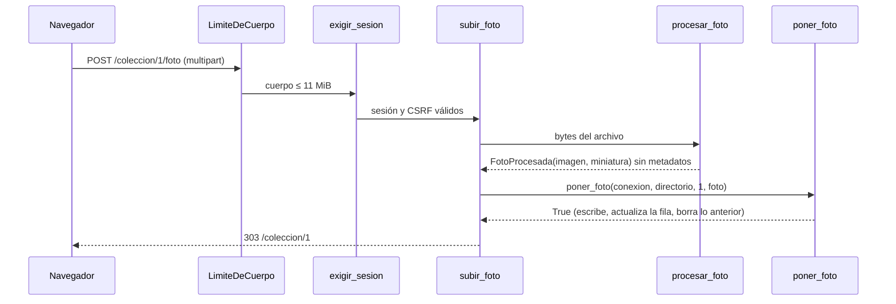

# Epic e3: Specimen photos — Docs

## Worked example

Subir la foto de un teléfono a un ejemplar, con valores reales (medidos en la prueba manual de s3.4).

Entrada: `POST /coleccion/1/foto`, multipart, `csrf=<token de la sesión>` y `foto=orquidea.jpg` (JPEG 4000x3000, 188 841 bytes, con EXIF con GPS, XMP y comentario).

1. `LimiteDeCuerpo` (`web/limite.py`): el cuerpo mide ~189 KB, menos de `LIMITE_DE_CUERPO` (11 MiB); pasa.
2. `exigir_sesion` (`web/sesion.py`, dependencia global): valida la cookie `__Host-sesion` y el campo `csrf` (403 si falta).
3. `subir_foto` (`web/rutas/coleccion.py`): `_ejemplar_o_404` carga el ejemplar 1; lee los bytes del archivo.
4. `procesar_foto` (`datos/fotos.py`): `Image.open` lee solo la cabecera (formato JPEG, 12 MP ≤ 64 MP, 188 841 B ≤ 10 MiB), reduce a 1600x1200 (`resize` con `reducing_gap`), reconstruye desde los bytes de los píxeles y guarda dos JPEG: imagen 1600x1200 (11 535 B, calidad 85) y miniatura 192x144 (~0,7 KB en la prueba, calidad 75). Ninguna contiene `Exif`, `ns.adobe.com/xap` ni el comentario.
5. `poner_foto` (`datos/almacen_fotos.py`, bajo el cerrojo): escribe `{nombre}.jpg` y `{nombre}-mini.jpg` en `/data/fotos` con `nombre = secrets.token_urlsafe(16)` (p. ej. `10O_C_S-EnNaRQmzeq4-6A`), actualiza `ejemplares.foto` y borra los archivos de la foto anterior.
6. Respuesta `303` a `/coleccion/1`. `GET /coleccion/1/foto` devuelve `200 image/jpeg` (11 535 B) con `X-Content-Type-Options: nosniff`, y "Mi colección" muestra ``.



## Extension guide

**Añadir rutas nuevas (e4: riegos y floraciones).** `web/app.py` solo monta routers.

1. Crea `src/orquidea/web/rutas/{area}.py` con `router = APIRouter()` y usa `Base` y `templates` (`from orquidea.web.sesion import Base`, `from orquidea.web.plantillas import templates`).
2. En `web/app.py` añade `from orquidea.web.rutas import {area}` y `app.include_router({area}.router)`. La dependencia global `exigir_sesion` ya protege la ruta y exige CSRF en todo `POST`: no la repitas.
3. Añade las rutas a `RUTAS` en `tests/test_web_rutas.py`. `test_web_proteccion.py` las recorre solo sin sesión.
4. Si el nombre del camino puede confundirse con un id (`/coleccion/nuevo` frente a `/coleccion/{id}`), regístralo antes.

**Cambiar el tamaño o la calidad de las imágenes.** Las constantes viven en `datos/fotos.py` (`ANCHO_MAXIMO`, `LADO_MINIATURA`, `TAMANO_MAXIMO`, `PIXELES_MAXIMOS`) y en `web/app.py` (`LIMITE_DE_CUERPO`). Después: `./scripts/check` (las pruebas de deriva de `test_despliegue.py` exigen que el README diga la misma cifra), `uv run python scripts/medir-primera-carga.py` para el presupuesto de 200 KB, y un nuevo ADR que sustituya al vigente (ADR-007), sin editarlo.

**Añadir una columna o tabla.** Un archivo `NNNN-nombre.sql` nuevo en `datos/migraciones/` (el siguiente es `0004`); nunca se edita una migración aplicada (ADR-003).

Errores comunes: guardar bytes del archivo original en vez de `FotoProcesada`; formar una ruta de archivo con un id o con datos de la petición (solo `ruta_de_foto`); enumerar `app.routes` a secas en una prueba (usa `tests/fabricas.py::rutas_registradas`); tocar la tabla `ejemplares` o el directorio de fotos sin pasar por el cerrojo de `almacen_fotos`.

## Data flow

```
navegador ──multipart──▶ LimiteDeCuerpo ──▶ exigir_sesion ──▶ subir_foto (web/rutas/coleccion.py)
   bytes ≤ 10 MiB ──▶ procesar_foto (datos/fotos.py) ──▶ FotoProcesada{imagen: bytes, miniatura: bytes}
   ──▶ poner_foto (datos/almacen_fotos.py) ──▶ {ORQUIDEA_FOTOS}/{nombre}.jpg, {nombre}-mini.jpg
                                            └▶ ejemplares.foto = nombre  (datos/ejemplares.py::fijar_foto)
lectura: GET /coleccion/{id}/foto[/miniatura] ──▶ obtener(ejemplar).foto ──▶ ruta_de_foto ──▶ FileResponse(image/jpeg)
baja:    POST /coleccion/{id}/quitar ──▶ quitar_con_foto ──▶ fila y archivos; POST .../foto/quitar ──▶ quitar_foto
```

Tipos en cada frontera: `bytes` → `FotoProcesada` (dataclass congelada) → `str | None` en `Ejemplar.foto` (modelo `coleccion/modelo.py`). Errores de dominio: `FotoInvalida` (→ 422), `NombreDeFotoInvalido` (→ 404), `DirectorioDeFotosNoEscribible` (detiene el arranque), `OSError` al guardar (→ 500 controlado). El directorio sale de `directorio_de_fotos(ruta_base)`: `ORQUIDEA_FOTOS` o `fotos/` junto a la base (`/data/fotos` en la imagen).

## Invariants & contracts

| Invariante | Síntoma si se viola | Cómo comprobarlo |
|---|---|---|
| Ningún archivo de foto lleva EXIF, GPS, XMP, comentario ni ICC | una foto revela dónde se tomó | `tests/test_datos_fotos.py` y `test_web_fotos.py` buscan los bytes; `strings {nombre}.jpg \| grep -i exif` |
| Imagen ≤ 1600 px de ancho y miniatura ≤ 192 px de lado mayor | listas pesadas | `test_datos_fotos.py`; `scripts/medir-primera-carga.py` |
| Una foto por ejemplar; `ejemplares.foto` nombra exactamente los dos archivos vigentes | archivos huérfanos o "sin foto" con archivo | `ls fotos/` frente a `select foto from ejemplares`; `test_dos_subidas_simultaneas_dejan_una_sola_foto` |
| Orden escribir → actualizar → borrar bajo el cerrojo | fila que apunta a un archivo inexistente | `test_datos_almacen_fotos.py` (fallo de la segunda escritura, hilos) |
| La ruta de un archivo sale solo de un nombre `[A-Za-z0-9_-]{1,64}` | lectura fuera del directorio | `ruta_de_foto`; `test_un_nombre_invalido_...` |
| Toda ruta de fotos exige sesión; toda subida y borrado exigen CSRF | foto visible sin iniciar sesión, 200 en vez de 303/403 | `test_web_proteccion.py`, `test_web_fotos.py` |
| Cuerpo ≤ 11 MiB (413) y procesar una foto de 48 MP pica < 380 MB | proceso matado por memoria | `test_web_limite.py`, `test_datos_fotos_memoria.py` |
| Primera carga de "Mi colección" ≤ 200 KB (25 ejemplares de ejemplo: 146,5 KB) | lista lenta | `test_medicion.py`; el criterio con "Slow 3G" y fotos reales lo mide el humano |
| Las cifras del README son las de sus constantes | guía desactualizada | `tests/test_despliegue.py` |
| `/coleccion/nuevo` se registra antes que `/coleccion/{id}` | "nuevo" se lee como un id (422) | `test_web_rutas.py` |

## Failure-mode catalog

| Síntoma | Causa raíz | Diagnóstico | Arreglo |
|---|---|---|---|
| La foto guardada aún trae el texto del comentario aunque `getexif()` sale vacío | Pillow copia `comment` de `Image.info` al guardar; `copy`/`resize` conservan `info` | buscar el texto en los bytes del archivo | reconstruir con `Image.frombytes(...)` antes de guardar (s3.2, memoria `pillow-guarda-comentario-jpeg`) |
| Las pruebas de protección no ven ninguna ruta (`assert 0 >= 4`) | `include_router` deja `_IncludedRouter` en `app.routes` | imprimir `type(r)` de `app.routes` | `tests/fabricas.py::rutas_registradas` (s3.1) |
| Subir un archivo enorme responde 400/422 en vez de 413 | FastAPI convierte cualquier excepción al leer el cuerpo; el formulario urlencoded se corta a 1 MiB con 400 | `curl -H "Transfer-Encoding: chunked" -F ...` contra `uvicorn` real | `LimiteDeCuerpo` corta por señal (desconexión) y sustituye la respuesta por 413 (s3.4) |
| El servidor se queda sin memoria al subir una foto de teléfono | `procesar_foto` copiaba los píxeles varias veces (≈ 780 MB con 48 MP) | `resource.getrusage(...).ru_maxrss` de un proceso que solo procesa la foto | reducir antes de copiar; `test_datos_fotos_memoria.py` (`fix(fotos)`, `epic-review`) |
| Dos subidas simultáneas dejan archivos sueltos | carrera entre leer la foto vigente y cambiarla | contar archivos en `fotos/` frente a `ejemplares.foto` | cerrojo de proceso en `almacen_fotos` (un solo proceso, ADR-001); con varios procesos habría que revisarlo |
| La aplicación no arranca: "No se puede escribir en el directorio de fotos ..." | el volumen pertenece a otro usuario que `app` (uid 10001) | `ls -ld /data /data/fotos` | `chown 10001 carpeta` (README, Despliegue) |
| La lista pesa más de lo esperado con fotos reales | miniaturas de 320 px de ADR-005 (~15 KB c/u) | `uv run python scripts/medir-primera-carga.py ~/fotos/*.jpg` | miniatura de 192 px (ADR-007); si aún pesa, bajar la calidad o cachear (parking lot) |
| `test_despliegue` falla tras cambiar una constante | el README repite la cifra | leer el mensaje: nombra la cifra faltante | actualizar el README |
| Una foto aparece rota tras restaurar un respaldo | la base y el directorio de fotos se respaldaron por separado | comparar `fotos/` con la columna `foto` | respaldar `/data` completo |
| Una prueba de mutación pasa o falla sin motivo aparente | bytecode viejo (mismo tamaño y mtime) | `find src tests -name __pycache__ -prune -exec rm -rf {} +` y repetir | limpiar `__pycache__` al mutar y al restaurar (memoria `mutation-checks-stale-bytecode`) |
