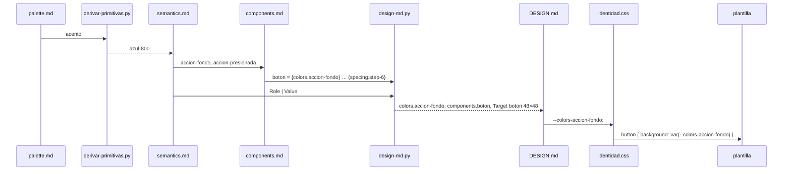
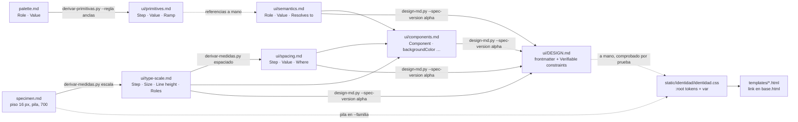

# Epic e5: Visual identity — Docs

## Worked example

Cómo llega el azul de la paleta al fondo del botón "Registrar riego", con los valores reales de `develop` al cerrar e5.

1. **Paleta** (`governance/identity/palette.md`, ADR-012): el rol `acento` vale `#1F3A5F`. Lo firmó el humano el 2026-09-22 frente a fotos reales de orquídeas.
2. **Primitivas:** `uv run python scripts/derivar-primitivas.py governance/identity/palette.md --regla anclas` convierte `#1F3A5F` a OKLCH (L ≈ 0.35) y lo asigna al escalón de la rejilla con la luminosidad más cercana: el índice 9, `azul-800` (L de la rejilla 0.3455), donde queda **exacto** (regla de anclas, desvío 0.000). Los escalones que no son ancla interpolan croma y tono en OKLCH entre el blanco del escalón 0 y el ancla. El siguiente más oscuro, `azul-900`, sale `#0C274A`. La salida se copia sin editar a `governance/identity/ui/primitives.md`, y `tests/test_derivar_primitivas.py` la regenera en cada `./scripts/check`.
3. **Roles semánticos** (`governance/identity/ui/semantics.md`, ADR-013): `accion-fondo` es una referencia a `azul-800` (`#1F3A5F`), y `accion-presionada` al escalón siguiente, `azul-900` (`#0C274A`). Medido: `accion-texto` (`#FFFFFF`) sobre `accion-fondo` da 11.48:1 y sobre `accion-presionada` 14.95:1, contra 7:1.
4. **Componente** (`governance/identity/ui/components.md`, ADR-014): `boton` = `{colors.accion-fondo}` / `{colors.accion-texto}` / `{typography.step-0}` / padding `{spacing.step-2}` / alto y ancho `{spacing.step-6}`. Con la escala (A) y el espaciado (A), eso es 16 px sobre 24, relleno de 16 y un objetivo de 48 × 48.
5. **`DESIGN.md`:** `design-md.py --spec-version alpha --name Orquídea …` (el comando completo está en ADR-014) escribe `accion-fondo: "#1F3A5F"` en `colors` y `boton` en `components`. En *Verifiable constraints* deja el par `accion-texto | accion-fondo | text` y el objetivo `boton | 48 | 48`.
6. **Hoja** (`src/orquidea/web/static/identidad/identidad.css`, ADR-015): `:root` declara `--colors-accion-fondo: #1F3A5F;` y `--spacing-step-6: 48px;`. La regla `button` usa `background: var(--colors-accion-fondo); min-height: var(--spacing-step-6);`, y `button:active` usa `var(--colors-accion-presionada)`. `tests/test_identidad_hoja.py` lee el *frontmatter* de `DESIGN.md` y exige que cada propiedad de `:root` sea el token con su mismo valor.
7. **Plantilla** (`ejemplar_ficha.html`): `<button type="submit">Registrar riego</button>`, sin clase ni `style`. La regla de elemento `button` lo viste, y `tests/test_identidad_ui.py` comprueba sobre `DESIGN.md` que el botón mide ≥ 44 × 44.

## Extension guide

**Cambiar un color de la paleta** (por ejemplo, el `acento`):
1. Un ADR nuevo que reemplace a ADR-012 (un `accepted` no se edita). Cambia el valor en `palette.md` y corre `contraste-de-lectura.py governance/identity/palette.md`: todo par de texto a ≥ 7:1.
2. Regenera `primitives.md` con `derivar-primitivas.py … --regla anclas` y pega la salida. `tests/test_derivar_primitivas.py` se pone en rojo hasta que lo hagas.
3. **A mano:** actualiza los valores de `semantics.md` (las tablas `Role | Value` y `Token | Value | From`). Comprueba con `tokens.py provenance` sobre `primitives.md` + `semantics.md` concatenados, y con `contraste-de-lectura.py` y `tokens.py pairs` sobre `semantics.md`. **El gate no lo hace por ti** (ver *Failure-mode catalog*).
4. Regenera `DESIGN.md` con el comando de ADR-014 y actualiza `:root` en `identidad.css`. `tests/test_identidad_hoja.py` nombra cada propiedad que no coincida.

**Agregar un componente:** agrega una fila a la tabla `Component | backgroundColor | …` de `components.md`, solo con referencias `{colors.…}`, `{typography.step-…}` o `{spacing.step-…}` en ASCII. Regenera `DESIGN.md`. Si el componente es un control, dale `height` y `width`, y `tests/test_identidad_ui.py` lo medirá contra 44. Después agrega su regla en la hoja, solo con `var()`. Error común: poner un color de borde en la tabla. El vocabulario del formato no lo tiene, y `design-md.py` lo rechaza. Los bordes se usan directo como `var(--colors-campo-borde)` en la hoja.

**Agregar una página:** extiende `base.html`, pon un `` de solo texto (`… — Orquídea`) y agrega su ruta a `PAGINAS` en `tests/test_web_titulos.py`. La prueba de cobertura falla hasta que lo hagas. Un enlace que no va dentro de una frase lleva `class="accion"`, porque `tests/test_identidad_hoja.py::test_todo_enlace_suelto_es_un_objetivo_de_48` lo exige. Nunca un atributo `style`.

**Agregar un valor a la hoja que no es token:** solo si entra en la lista cerrada de ADR-015 (`0`, `100%`, `1px` en bordes, `2px` en el anillo de foco, `700`). Otro literal pide un ADR y un cambio en `ADMITIDOS` de `tests/test_identidad_hoja.py`, no un parche.

## Data flow

- **Tipos en las fronteras:** tablas markdown con cabeceras fijas. Cada lector las encuentra por la primera celda de la cabecera; `design-md.py`, por las dos primeras.
  - `contraste-de-lectura.py` y `tokens.py pairs`: `Role | Value` y `Foreground | Ground | Kind`.
  - `tokens.py provenance`: `Step | Value` y `Token | Value | From`.
  - `design-md.py`: `Role | Value`, `Step | Size`, `Step | Value` y `Component | {vocabulario}`.
  - `tokens.py targets` y `comprobar-medidas.py objetivos`: `Target | Width | Height`.
- **Medición:** `scripts/medir-primera-carga.py` monta una colección temporal, pide `/coleccion` y suma en gzip todo lo que cuelga de `/static` por `src` o `href` (`Medicion.estaticos`: htmx y la hoja), más las miniaturas. Con `--identidad DIR` mide solo los recursos de la identidad contra 50 KB.
- **Instrumentos del addon** (gemba-design 0.21.0, en la caché del plugin, por ruta): `skills/techniques/ui/scripts/design-md.py`, `conventions/mechanical/instruments/tokens.py` y `skills/reviews/survival-review/scripts/{contrast,invariance}.py`.

## Invariants & contracts

| Invariante | Si se viola | Cómo comprobarlo |
|---|---|---|
| Todo par de texto de la identidad llega a ≥ 7:1 (ADR-009, criterio 2) | Texto ilegible al sol; el par más bajo hoy es `error` sobre `fondo`, 8.38:1 | `uv run python scripts/contraste-de-lectura.py governance/identity/ui/semantics.md` y lo mismo sobre `DESIGN.md`: exit 0 y población > 0 |
| Los componentes (bordes, foco, botones) llegan a ≥ 3:1 contra su fondo | Un campo sin borde visible; el más bajo, `campo-borde` sobre `fondo`, está en 3.34:1 | `python3 $G/tokens.py pairs governance/identity/ui/semantics.md` |
| `primitives.md` es exactamente la salida de la regla registrada | `test_primitives_md_es_lo_que_la_regla_registrada_produce` en rojo | `./scripts/check` |
| Las tablas de `type-scale.md` y `spacing.md` son la salida de `derivar-medidas.py` | `test_el_entregable_es_lo_que_la_regla_registrada_produce` en rojo | `./scripts/check` |
| Ningún rol de lectura bajo 16 px ni escalones colapsados (M1) | `test_ningun_rol_de_lectura_de_la_escala_baja_de_16` en rojo | `comprobar-medidas.py piso governance/identity/ui/type-scale.md --piso 16 --lectura text,binomial,date` |
| Todo control de `DESIGN.md` ≥ 44 × 44 (M2) | `test_los_controles_de_design_md_miden_al_menos_44` en rojo | `comprobar-medidas.py objetivos governance/identity/ui/DESIGN.md --minimo 44` |
| Cada propiedad de `:root` es un token de `DESIGN.md` con su valor; fuera de `:root`, solo `var()` y la lista de ADR-015 | `test_la_hoja_usa_solo_tokens_de_la_identidad` nombra la propiedad o el literal | `uv run pytest tests/test_identidad_hoja.py` |
| Ninguna plantilla lleva `style=`; todo enlace fuera de una frase lleva `accion` | Rojo en `test_ninguna_plantilla_lleva_estilo_en_linea` o en `test_todo_enlace_suelto_es_un_objetivo_de_48` | ídem |
| Todo `<title>` de página es texto sin marcado, y toda ruta GET HTML está probada | Rojo en `tests/test_web_titulos.py`, nombrando la página o la ruta sin cubrir | `uv run pytest tests/test_web_titulos.py` |
| Identidad ≤ 50 KB gzip; primera carga ≤ 200 KB | `medir-primera-carga.py` sale con 1 | Hoy: 1.6 KB y 148.1 KB con 25 fotos. **No está en el gate**: se corre a mano |
| Los identificadores de token son ASCII (`accion-fondo`, `linea`) | `design-md.py` sale con `refused: … is '{colors.acción-…}'` | La regex del generador; ADR-014 |
| Los scripts 0/1/2 salen con 1 solo cuando falla el criterio | Un traceback de Python sale con 1 y parece un rojo | Alimentar con una fila corta o sin tabla: debe dar 2 |

## Failure-mode catalog

- **"Cambié un color en `semantics.md` y todo sigue en verde."** Causa: el gate no ata `semantics.md` a `primitives.md`, ni `DESIGN.md` a sus tablas (epic-review de e5). Diagnóstico: `cat governance/identity/ui/primitives.md governance/identity/ui/semantics.md > /tmp/x.md && python3 $G/tokens.py provenance /tmp/x.md`, y regenerar `DESIGN.md` y comparar con `cmp`. Arreglo: el paso manual de la guía; la prueba que falta está aparcada.
- **"`design-md.py` dice `refused: … names no token` o rechaza `#FFFFFF` como medida."** Causa: se le pasó `primitives.md`, cuya tabla `Step | Value | Ramp` lee como espaciado, o `palette.md`/`specimen.md`. Diagnóstico: revisar la lista de archivos del comando contra ADR-014. Arreglo: pasarle solo `semantics.md`, `type-scale.md`, `spacing.md` y `components.md`.
- **"`design-md.py` rechaza `{colors.acción-fondo}`."** Causa: acepta solo referencias ASCII (`^\{([a-z][A-Za-z0-9.-]*)\}$`), aunque el spec no lo exige. Diagnóstico: el mensaje nombra la celda. Arreglo: identificadores ASCII (ADR-014). Hallazgo del addon aparcado.
- **"`invariance.py` sale con 2 por `unreadable variant value '—'`."** Causa: la columna `Variant` con `—` (sin variante declarada) se lee como valor ilegible, no como falta de sujeto. Diagnóstico: `invariance.py palette.md tinta papel`. Arreglo: en `semantics.md` la columna se quitó; `palette.md` la conserva. Hallazgo del addon aparcado.
- **"Una prueba de regeneración sobrevive a una mutación de redondeo."** Causa: `round()` redondea al par, y un caso con `.5` de parte entera impar no lo distingue de medio hacia arriba (s5.6). Diagnóstico: mutar `floor(x + 0.5)` por `round(x)` y correr la prueba. Arreglo: un caso con `.5` de parte entera par (12 px → 4.5).
- **"Una prueba de HTML se rompió sin que cambiara nada visible."** Causa: contaba una subcadena de etiqueta (`"<li"`) que también está en `<link rel="stylesheet">` (s5.7). Diagnóstico: `grep -c "<li" ` en el HTML servido. Arreglo: localizar con límite de nombre (`<li[\s>]`) o dentro del contenedor.
- **"Un enlace es difícil de tocar en el teléfono."** Causa: le falta `class="accion"` y mide la altura de la línea (24 px). El diseño de s5.7 supuso la excepción *inline* para enlaces sueltos. Diagnóstico: `test_todo_enlace_suelto_es_un_objetivo_de_48`, que lista los enlaces sin clase. Arreglo: agregar la clase, o sumar el enlace a `EN_UNA_FRASE` si de verdad va dentro de una frase.
- **"La captura a 360 px se ve desbordada."** Causa: Chrome sin interfaz en Windows no baja de unos 500 px de ancho y recorta la captura. Diagnóstico: comparar con la página en un `iframe` de 360. Arreglo: capturar la página contenedora con el `iframe` (memoria `captura-360-en-chrome-de-windows`).
- **"El texto de ejemplo cargado con `curl` sale como `dÃa`."** Causa: `curl -d` manda bytes UTF-8 sin codificar. Diagnóstico: volver a guardar con `--data-urlencode` y ver si se corrige. Arreglo: `--data-urlencode`; la aplicación decodifica bien lo que manda un navegador.
- **"`survival-review` no corrió sobre una pieza."** Causa: el scope lo exigía y el `plan.md` de la historia no lo nombraba (s5.2–s5.4). Diagnóstico: `grep -i survival` en las retrospectivas de las historias. Arreglo: tarea explícita en el plan de toda historia que produce una pieza (memoria `survival-review-es-tarea-del-plan`).
- **"No se sabe si la primera carga cabe en 5 s."** Causa: el tiempo con "Slow 3G" nunca se ha medido (e1, e2, e3, e5), solo el peso. Diagnóstico: el parking lot. Arreglo: medirlo contra el primer despliegue en Dokploy.
